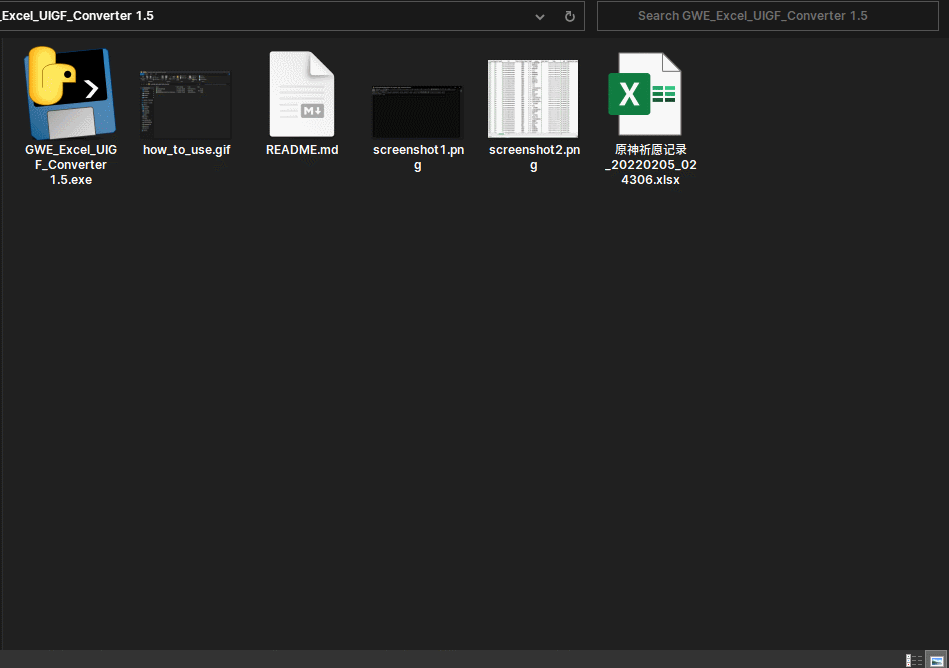
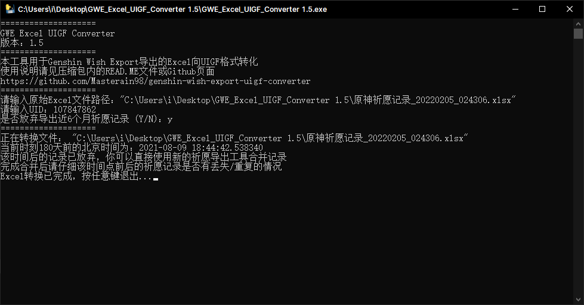
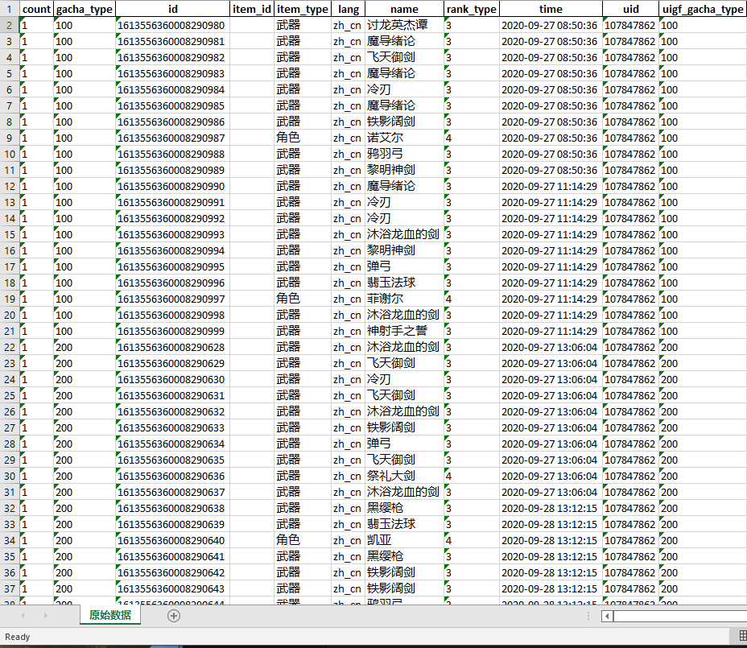

# genshin-wish-export-uigf-converter
A Python tool to convert genshin-wish-expoert data to UIGF format

将 [genshin-wish-expoert](https://github.com/biuuu/genshin-wish-export) 的数据转化为 [UIGF](https://github.com/DGP-Studio/Snap.Genshin/wiki/StandardFormat) 格式

## ID生成

- 第一次祈愿的ID记为 `1012303100000000000 - 记录的总祈愿次数`
- 此后每条祈愿记录ID顺次`+1`

## 使用方法

1. 运行程序
2. 拖入`genshin-wish-expoert`导出的Excel文件，或者手动输入该文件的路径（同目录下只需输入该文件的文件名）
3. 输入你的游戏 UID
4. 1. 选择是否放弃近6个月的祈愿记录**（建议放弃）**
      1. 如果不放弃，则在使用新的祈愿导出工具时会出现祈愿记录重复的情况
      2. 如果放弃，6个月内的数据可以由新使用的祈愿导出工具重新从原神服务器获取
5. 等待程序运行完成，导出文件名为`uigf_游戏UID.xlsx`

## 截图

